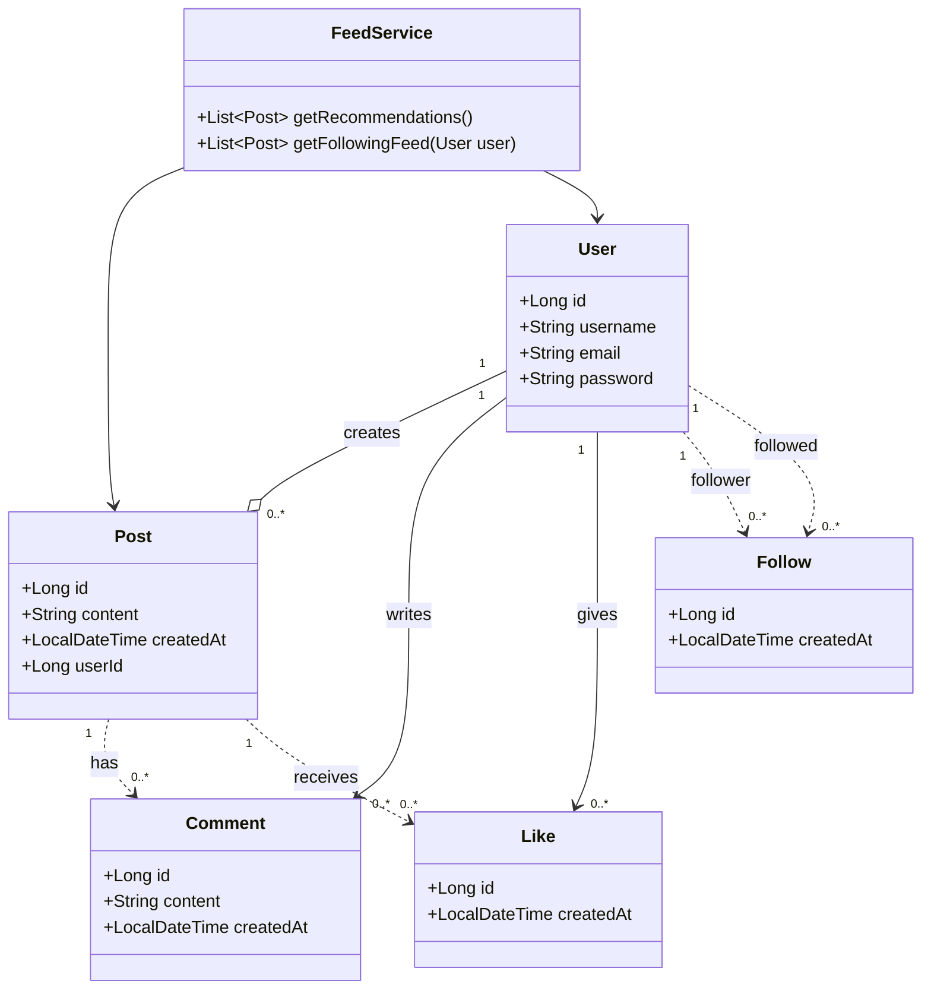

# MINIATURE

## Diagramme de classes

```mermaid
classDiagram

class User {
  +Long id
  +String username
  +String email
  +String password
}

class Post {
  +Long id
  +String content
  +LocalDateTime createdAt
  +Long userId
}


class Comment {
  +Long id
  +String content
  +LocalDateTime createdAt
}

class Like {
  +Long id
  +LocalDateTime createdAt
}

class Follow {
  +Long id
  +LocalDateTime createdAt
}

class FeedService {
  +List~Post~ getRecommendations()
  +List~Post~ getFollowingFeed(User user)
}

User "1" --o "0..*" Post : creates
User "1" --> "0..*" Comment : writes
User "1" --> "0..*" Like : gives

Post "1" ..> "0..*" Comment : has
Post "1" ..> "0..*" Like : receives

User "1" ..> "0..*" Follow : follower
User "1" ..> "0..*" Follow : followed

FeedService --> Post
FeedService --> User
```