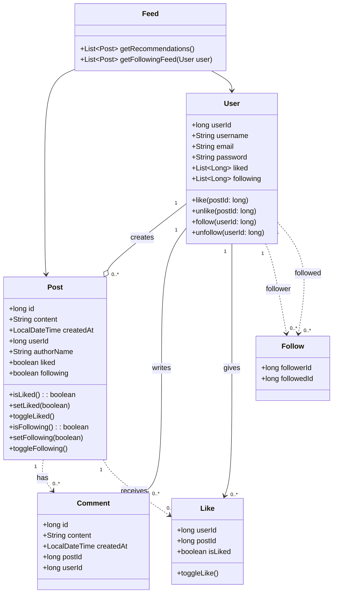

# MINIATURE

## Diagramme de classes

```mermaid
classDiagram
%% Classes principales

class User {
    +long userId
    +String username
    +String email
    +String password
    +List~Long~ liked
    +List~Long~ following
    +like(postId: long)
    +unlike(postId: long)
    +follow(userId: long)
    +unfollow(userId: long)
}

class Post {
    +long id
    +String content
    +LocalDateTime createdAt
    +long userId
    +String authorName
    +boolean liked
    +boolean following
    +isLiked(): boolean
    +setLiked(boolean)
    +toggleLiked()
    +isFollowing(): boolean
    +setFollowing(boolean)
    +toggleFollowing()
}

class Like {
    +long userId
    +long postId
    +boolean isLiked
    +toggleLike()
}

class Follow {
    +long followerId
    +long followedId
}

class Comment {
    +long id
    +String content
    +LocalDateTime createdAt
    +long postId
    +long userId
}

class Feed{
    +List~Post~ getRecommendations()
    +List~Post~ getFollowingFeed(User user)
}

%% Relations

User "1" --o "0..*" Post : creates
User "1" --> "0..*" Comment : writes
User "1" --> "0..*" Like : gives

Post "1" ..> "0..*" Comment : has
Post "1" ..> "0..*" Like : receives

User "1" ..> "0..*" Follow : follower
User "1" ..> "0..*" Follow : followed

Feed --> Post
Feed --> User
```